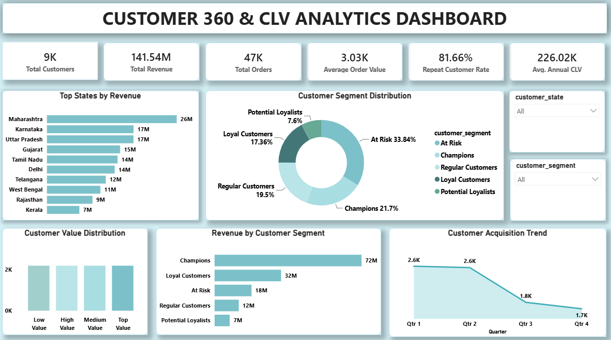

# 📊 Customer 360 & CLV Analytics Dashboard

Synthetic but realistic e-commerce transaction dataset for portfolio analysis.

Files:
- customers.csv
- orders.csv
- order_items.csv
- products.csv

Approximate size:
- 10,000 customers
- 60,000 orders
- 120,000+ order items
- 2,000 products

Intended workflow: SQL → Python/Pandas → Power BI/DAX.

---

## 🧹 Data Preparation

The dataset was prepared for analysis through the following steps:

- Checked for missing values
- Checked for duplicate records
- Validated data types
- Prepared customer-level analytical data
- Created calculated metrics for customer analysis
- Prepared the final dataset for Power BI reporting

---

## 📌 Project Overview

The **Customer 360 & Customer Lifetime Value (CLV) Analytics Dashboard** is an end-to-end data analytics project designed to provide a comprehensive view of customer behavior, customer value, revenue performance, and customer segments.

The objective of this project is to help businesses understand:

- Who their most valuable customers are
- Which customer segments generate the highest revenue
- Which customers are at risk of churn
- Which states contribute the most revenue
- How customer acquisition changes over time
- How customer value is distributed across the customer base

The final insights are presented through an interactive **Power BI dashboard** that allows users to filter and analyze customer data dynamically.

---

# 🎯 Business Problem

Businesses often have large amounts of customer and transaction data but struggle to convert that data into actionable insights.

Key business questions addressed in this project include:

1. Who are the most valuable customers?
2. Which customer segments generate the highest revenue?
3. Which customers are at risk and may require retention efforts?
4. Which geographic regions generate the highest revenue?
5. What is the overall repeat customer rate?
6. What is the average customer lifetime value?
7. How is customer value distributed?
8. Is customer acquisition increasing or declining over time?

---

# 🔄 Project Workflow

Data Collection
↓
Data Cleaning & Validation
↓
SQL Analysis
↓
Python/Pandas Analysis
↓
Customer Segmentation & CLV Analysis
↓
Power BI Dashboard Development
↓
Business Insights & Recommendations

---

# 🛠️ Tools & Technologies

The following tools were used in this project:

- **Power BI** – Interactive dashboard development and data visualization
- **DAX** – KPI calculations and analytical measures
- **Power Query** – Data transformation and preparation
- **Data Analytics** – Customer segmentation and business analysis

---

## Dashboard Preview

---

# 📈 Key Performance Indicators

The dashboard tracks the following major business KPIs:

| KPI | Value |
|---|---:|
| Total Customers | 9K |
| Total Revenue | 141.54M |
| Total Orders | 47K |
| Average Order Value | 3.03K |
| Repeat Customer Rate | 81.66% |
| Average Annual CLV | 226.02K |

---

# 👥 Customer Segmentation Methodology

Customers were segmented using RFM analysis based on:

- **Recency:** How recently a customer made a purchase
- **Frequency:** How frequently a customer made purchases
- **Monetary Value:** How much revenue a customer generated

Based on customer purchasing behavior, customers were categorized into:

- Champions
- Loyal Customers
- Potential Loyalists
- Regular Customers
- At Risk Customers

---

# 📊 Dashboard Features

## 1️⃣ Top States by Revenue

This visualization identifies the states generating the highest revenue.

### Key Finding

**Maharashtra** is the highest revenue-generating state with approximately **26M** in revenue.

Other major revenue-generating states include:

- Karnataka
- Uttar Pradesh
- Gujarat
- Tamil Nadu
- Delhi

### Business Recommendation

The business should prioritize high-performing markets such as Maharashtra by implementing:

- Customer retention campaigns
- Personalized offers
- Loyalty programs
- Premium product promotions

Lower-performing markets can also be analyzed to identify potential growth opportunities.

---

# 2️⃣ Customer Segment Distribution

Customers are categorized into the following segments:

- At Risk
- Champions
- Regular Customers
- Loyal Customers
- Potential Loyalists

### Key Finding

The largest customer segment is:

🚨 **At Risk Customers – 33.84%**

Other customer segments include:

- Champions – 21.7%
- Regular Customers – 19.5%
- Loyal Customers – 17.36%
- Potential Loyalists – 7.6%

### Business Recommendation

Since a significant percentage of customers are categorized as **At Risk**, the business should implement customer retention strategies such as:

- Personalized offers
- Win-back campaigns
- Targeted discounts
- Email marketing campaigns
- Product recommendations

Reducing churn within this segment could protect a significant amount of revenue.

---

# 3️⃣ Revenue by Customer Segment

The dashboard analyzes how much revenue each customer segment generates.

| Customer Segment | Revenue |
|---|---:|
| Champions | 72M |
| Loyal Customers | 32M |
| At Risk | 18M |
| Regular Customers | 12M |
| Potential Loyalists | 7M |

### Key Finding

🏆 **Champions are the highest revenue-generating customer segment**, contributing approximately **72M** in revenue.

### Business Recommendation

The business should focus on protecting and retaining Champions through:

- VIP benefits
- Exclusive offers
- Premium services
- Personalized experiences
- Loyalty rewards

Loyal Customers can also be targeted with cross-selling and upselling strategies to move them toward the Champions segment.

---

# 4️⃣ At Risk Customer Analysis

One of the most important findings from this analysis is the size and revenue contribution of the **At Risk** customer segment.

### Key Findings

- At Risk customers represent approximately **33.84% of the customer base**
- They still generate approximately **18M in revenue**

### Business Risk

If a significant number of these customers churn, the business could experience a substantial revenue loss.

### Recommended Strategy

A structured **Customer Win-Back Program** could include:

1. Identifying customers with declining purchase frequency
2. Sending personalized promotional offers
3. Providing limited-time discounts
4. Recommending relevant products
5. Monitoring customer behavior after campaigns

The goal should be to move customers from:

**At Risk → Regular → Loyal → Champions**

---

# 5️⃣ Customer Value Distribution

Customers are grouped into different value categories:

- Low Value
- Medium Value
- High Value
- Top Value

### Key Finding

The dashboard provides a view of how customers are distributed across different value levels.

### Business Recommendation

Different strategies should be applied to each customer group.

#### 🏆 Top Value Customers
Focus on:

- Retention
- VIP treatment
- Exclusive rewards

#### 💎 High Value Customers
Focus on:

- Upselling
- Cross-selling
- Loyalty programs

#### 📈 Medium Value Customers
Focus on:

- Increasing purchase frequency
- Personalized product recommendations

#### 🌱 Low Value Customers
Focus on:

- Cost-effective engagement
- Entry-level promotions
- Product discovery

---

# 6️⃣ Customer Acquisition Trend

The dashboard tracks customer acquisition over time.

### Quarterly Trend

| Quarter | Customers Acquired |
|---|---:|
| Q1 | 2.6K |
| Q2 | 2.6K |
| Q3 | 1.8K |
| Q4 | 1.7K |

### Key Finding

📉 Customer acquisition remains stable during Q1 and Q2 but declines significantly during Q3 and Q4.

The trend moves approximately from:

**2.6K → 2.6K → 1.8K → 1.7K**

### Business Recommendation

The business should investigate:

- Marketing campaign performance
- Customer acquisition channels
- Conversion rates
- Seasonal effects
- Marketing spending
- Changes in customer behavior

Understanding the reason behind the decline could help improve future customer acquisition strategies.

---

# 🔁 Repeat Customer Analysis

## Repeat Customer Rate: 81.66%

### Key Finding

The business has a strong repeat customer rate of approximately **81.66%**.

This indicates that a significant proportion of customers make repeat purchases.

### Business Recommendation

The company should leverage this strong customer retention behavior through:

- Cross-selling
- Upselling
- Loyalty programs
- Personalized recommendations
- Subscription or membership opportunities

---

# 💰 Customer Lifetime Value

## Average Annual CLV: 226.02K

Customer Lifetime Value helps estimate the long-term value generated by customers.

### Business Importance

A higher CLV generally indicates that customers generate significant value over their relationship with the business.

### Business Recommendation

The company should prioritize strategies that increase customer lifetime value, including:

- Increasing purchase frequency
- Improving customer retention
- Increasing average order value
- Cross-selling additional products
- Retaining high-value customers

---

# 🔥 Key Business Insights

## 🥇 1. Maharashtra is the strongest revenue market

Maharashtra generates approximately **26M in revenue**, making it the leading market.

**Action:** Continue investing in customer retention and growth strategies in this market.

---

## 💎 2. Champions are the most valuable customer segment

Champions generate approximately **72M in revenue**, making them the most important segment from a revenue perspective.

**Action:** Protect these customers through VIP and loyalty programs.

---

## 🚨 3. At Risk customers represent the largest customer segment

Approximately **33.84% of customers** belong to the At Risk segment.

**Action:** Implement targeted churn prevention and win-back campaigns.

---

## 🔁 4. The business has a strong repeat customer rate

The repeat customer rate is approximately **81.66%**.

**Action:** Use existing customer relationships to increase revenue through upselling and cross-selling.

---

## 📉 5. Customer acquisition declines after Q2

Customer acquisition drops from approximately **2.6K in Q1/Q2** to **1.8K in Q3** and **1.7K in Q4**.

**Action:** Investigate marketing channels, conversion rates, and seasonal patterns.

---

# 🎯 Strategic Recommendations

Based on the analysis, the following actions are recommended:

### 1. 🚨 Reduce Customer Churn

Focus on the large At Risk customer segment using:

- Win-back campaigns
- Personalized offers
- Customer engagement strategies

---

### 2. 🏆 Protect High-Value Customers

Provide Champions with:

- Exclusive rewards
- VIP benefits
- Personalized experiences

---

### 3. 📈 Improve Customer Acquisition

Investigate the decline in customer acquisition and optimize:

- Marketing campaigns
- Acquisition channels
- Conversion strategies

---

### 4. 💰 Increase Customer Lifetime Value

Use:

- Cross-selling
- Upselling
- Personalized recommendations
- Loyalty programs

to increase long-term customer value.

---

### 5. 🌍 Optimize Regional Strategy

Prioritize high-performing states while identifying growth opportunities in lower-performing regions.

---

# 📐 Dashboard Components

The Power BI dashboard includes:

### KPI Cards

- Total Customers
- Total Revenue
- Total Orders
- Average Order Value
- Repeat Customer Rate
- Average Annual CLV

### Visualizations

- Top States by Revenue
- Customer Segment Distribution
- Customer Value Distribution
- Revenue by Customer Segment
- Customer Acquisition Trend

### Interactive Filters

- Customer State
- Customer Segment

---

# 📊 Key Metrics

The dashboard uses business metrics to measure customer and revenue performance.

### Total Customers

**Definition:** Total unique customers in the dataset.

**Purpose:** Measures the overall customer base.

### Total Revenue

**Definition:** Total revenue generated by all customers.

**Purpose:** Measures overall business revenue.

### Total Orders

**Definition:** Total number of customer orders.

**Purpose:** Measures customer purchasing activity.

### Average Order Value

**Definition:** Average revenue generated per order.

**Purpose:** Measures the average value of each customer transaction.

### Repeat Customer Rate

**Definition:** Percentage of customers who made repeat purchases.

**Purpose:** Measures customer retention and loyalty.

### Average Annual CLV

**Definition:** Average annual customer lifetime value across all customers.

**Purpose:** Measures the long-term value generated by customers.

## 👤 Author

Tushar Sharma
Aspiring Data Analyst
